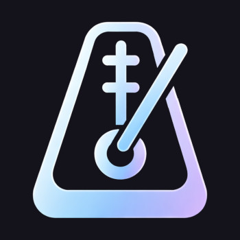

# Lentando

**Mindful habit tracking** - A zero-friction habit and substance use tracker that runs in your browser.

## What It Does

Lentando helps you track substance use, urges resisted, and healthy habits.

It's designed for harm reduction, not judgment. Every small win counts.

### Features

- **One-tap logging** - Log sessions, resisted urges, or healthy habits with a single tap
- **Multi-addiction profiles** - Cannabis, alcohol, nicotine, or custom tracking
- **30+ win awards** - Automatic recognition of streaks, gaps, tapers, harm reduction, mindfulness, and more
- **Visual analytics** - View graphs for sessions, amounts, urges resisted, and exercise
- **Hourly heatmaps** - See usage patterns by time of day
- **Day-by-day history** - Browse previous days with full event details and editing
- **Coaching tips** - Gentle nudges toward water, breathing, and movement after resisting
- **Dark/light theme** - Follows system preference or toggle manually
- **To-do list** - Built-in task tracking to help you stay organized
- **Import/export** - Full JSON backup and restore with duplicate detection
- **PWA support** - Install to home screen, works offline, network-first updates

### Tracked Win Types

| Category | Examples |
|---|---|
| **Session** | Resist, Delay, CBD Replacement, Harm Reduction, Low Dose, Mindful Session |
| **Daily** | CBD-Only Day, Zero THC Day, Low Day (≤2 units), T-Break Day, Hydrated (4+ waters) |
| **Timing** | Gap Wins (1–12h), Held Off Until Afternoon |
| **Comparison** | Fewer than yesterday, Lower amount, First later / Last earlier |
| **Habits** | Habit Stack (2+ habit types) |
| **Streaks** | Resist Streak, Habit Streak, Taper Win (consecutive declining days) |
| **Engagement** | Welcome Back (24+ hours away) |

## Getting Started

1. [Open the Lentando webpage in any modern browser](https://killedbyapixel.github.io/Lentando/)
2. Select what you're tracking (cannabis, alcohol, nicotine, or other)
3. Start logging and get healthy

That's it!

## Tech Stack

- **Vanilla JavaScript** using ES6 modules — no frameworks, no dependencies, no build step
- **localStorage** for persistence — `ht_events`, `ht_settings`, `ht_todos`, `ht_theme`
- **Service Worker** — Network-first caching strategy for instant updates
- **CSS custom properties** for theming with dark/light mode
- **Mobile-first** responsive design (max-width 480px)
- **PWA manifest** — Installable as standalone app

## License

© 2026 Frank Force. All rights reserved. See [LICENSE](LICENSE) for details.
