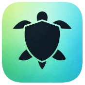
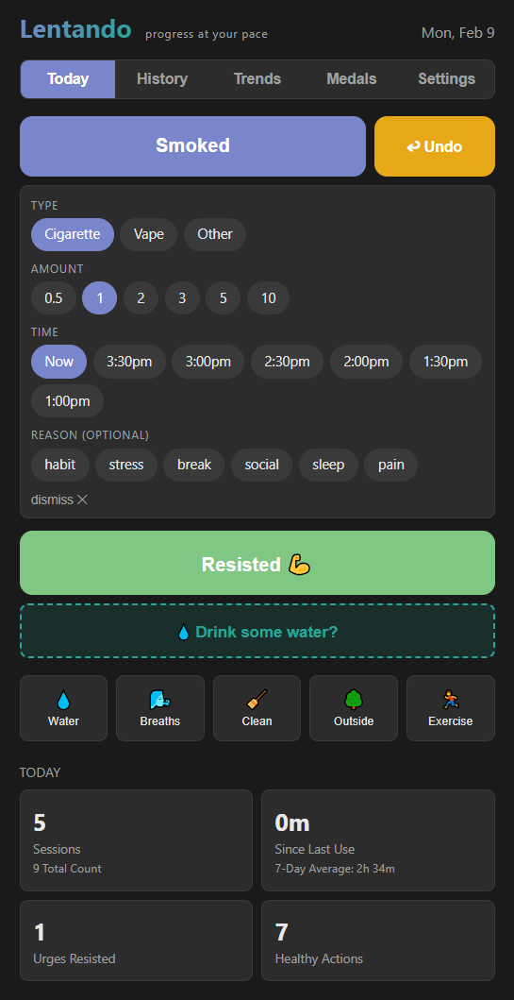

# Lentando

**Mindful progress tracking** — A zero-friction habit and substance use tracker that runs in your browser.

**[🚀 Try it now → lentando.3d2k.com](https://lentando.3d2k.com)**

## What It Does

Lentando helps you track substance use, urges resisted, and healthy habits.

It's designed for harm reduction, not judgment. Every small win counts.

### Features

- **One-tap logging** — Log sessions, resisted urges, or healthy habits with a single tap
- **Multi-profile support** — Cannabis, alcohol, nicotine, or custom tracking
- **Cloud sync** — Sign in with Google or email to sync across devices (optional)
- **45+ win awards** — Automatic recognition of streaks, gaps, timing improvements, and healthy choices
- **Visual analytics** — Graphs for sessions, amounts, time-of-day usage, and more
- **Day-by-day history** — Browse and edit previous days with full event details
- **Coaching tips** — Gentle nudges toward alternative healthy habits
- **My Plan** — Built-in task list to set goals and track progress
- **PWA support** — Install to home screen, works offline

### Win Categories

- **Daily Progress** — No Use Day, Low Day, Daily Check-in, Good Start, Hydrated
- **Session Wins** — Resist, Urge Surfed, Swap Completed, Low Dose, Mindful Session
- **Resist Awareness** — Intensity Logged, Trigger Identified, Full Report, Tough Resist
- **Timing Wins** — Delayed Start, First Later, Last Earlier, Fewer Sessions, Lower Amount
- **Gap Milestones** — 1h, 2h, 4h, 8h, and 12h gaps between sessions
- **Break Milestones** — 1 Day through 1 Year of consecutive clean days
- **Streaks** — Resist Streak, Habit Streak, Taper Win, App Streak, Week/Month/Year Streak
- **Mindful Choices** — Second Thought, Harm Reduction, CBD-Only Day, Exercise + Water Combo

## Getting Started

1. Open the Lentando webpage in any modern browser.
2. Select what substance you're tracking.
3. Start logging and get healthy!

